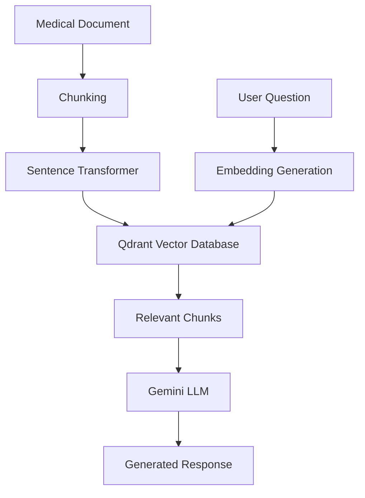

# MedQuery AI


Medical knowledge assistant powered by Retrieval-Augmented Generation (RAG).

---

## Overview

MedQuery AI is a medical RAG chatbot built using:

- FastAPI
- Qdrant Vector Database
- Sentence Transformers
- Google Gemini
- SQLite

The system retrieves relevant medical information from uploaded documents and generates context-aware responses using Gemini.

---

## Features

✅ Document Upload

✅ Text Chunking

✅ Embedding Generation

✅ Qdrant Vector Storage

✅ Semantic Search

✅ Retrieval-Augmented Generation (RAG)

✅ Gemini Integration

✅ Chat Memory

✅ Swagger Documentation

✅ Health Endpoint

---

## Architecture



## Technology Stack

| Component | Technology |
|------------|------------|
| Backend | FastAPI |
| Vector Database | Qdrant |
| Embeddings | Sentence Transformers |
| LLM | Gemini |
| Database | SQLite |
| Language | Python |

---

## API Endpoints

### Health Check

```http
GET /
```

### Upload Document

```http
POST /ingest
```

### Chat

```http
POST /chat
```

---

## Screenshots

### API Overview


### Health Endpoint


### Document Upload


### Successful Ingestion


### Chat Interface


### Chat Response


---

## Installation

```bash
git clone https://github.com/Anmolbhattarai-AI/medical-rag-chatbot.git

cd medical-rag-chatbot

pip install -r requirements.txt

uvicorn app.main:app --reload
```

---

## Future Improvements

- PDF Support
- Multiple Document Upload
- Hybrid Search
- Citation Support
- Frontend Interface
- Docker Deployment

---

## Author

Anmol Bhattarai

Computer Science and Engineering

BMS College of Engineering, Bangalore
