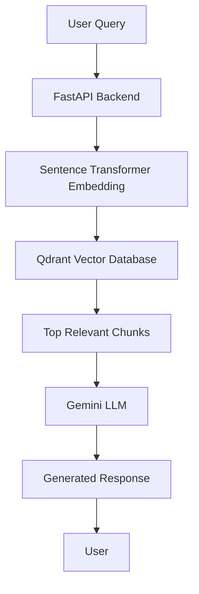

# Medical RAG Chatbot

AI-powered Retrieval-Augmented Generation (RAG) chatbot built using FastAPI, Qdrant, Sentence Transformers, and Google Gemini.

## Overview

This project implements a complete Retrieval-Augmented Generation (RAG) pipeline for intelligent medical question answering.

The system retrieves relevant information from a vector database using semantic search and then uses Google's Gemini Large Language Model to generate context-aware responses.

## Features

* Semantic Search using Sentence Transformers
* Vector Database Storage with Qdrant
* Document Chunking Pipeline
* Conversational Memory
* Gemini-Powered Response Generation
* FastAPI REST API
* Medical Knowledge Retrieval

## Architecture



## Technology Stack

| Component       | Technology            |
| --------------- | --------------------- |
| Backend         | FastAPI               |
| Vector Database | Qdrant                |
| Embeddings      | Sentence Transformers |
| LLM             | Google Gemini         |
| Database        | SQLite                |
| Language        | Python                |

## Installation

```bash
git clone https://github.com/Anmolbhattarai-AI/medical-rag-chatbot.git

cd medical-rag-chatbot

pip install -r requirements.txt

uvicorn app.main:app --reload
```

## API Documentation

Open:

```text
http://127.0.0.1:8000/docs
```

FastAPI automatically provides Swagger UI documentation.

## Example Query

Question:

```text
What is heart disease?
```

Answer:

```text
Heart disease is a condition affecting the cardiovascular system.
```

## Future Improvements

* Frontend Interface
* Authentication
* Multi-document Upload
* Hybrid Search
* Evaluation Framework
* Citation Support

## Author

Anmol Bhattarai

Computer Science Engineering Student

BMS College of Engineering Bangalore
