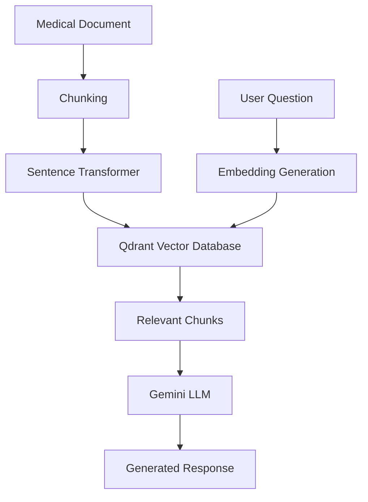
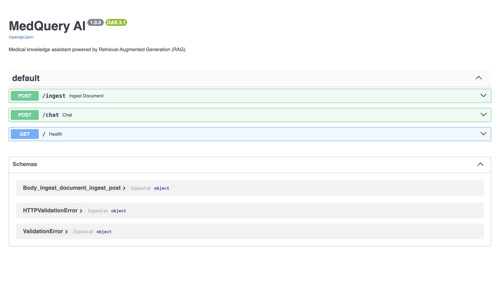
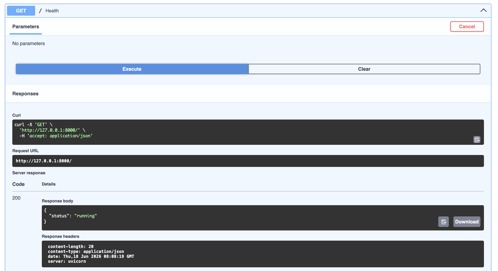
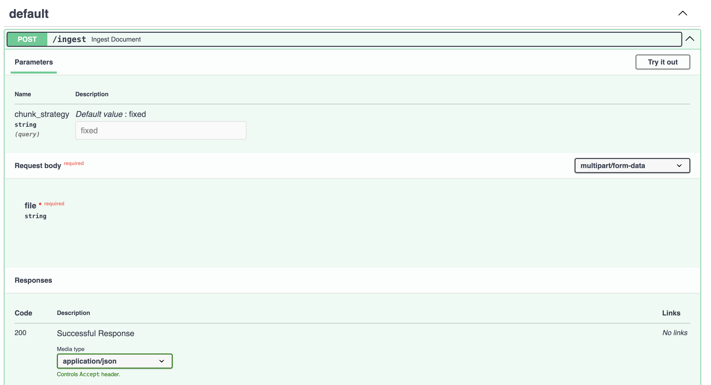
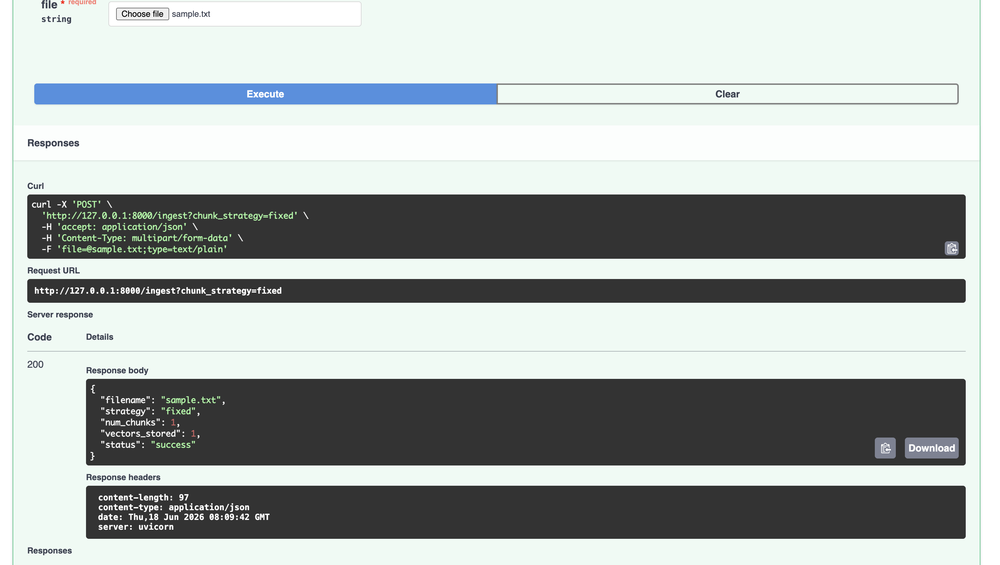
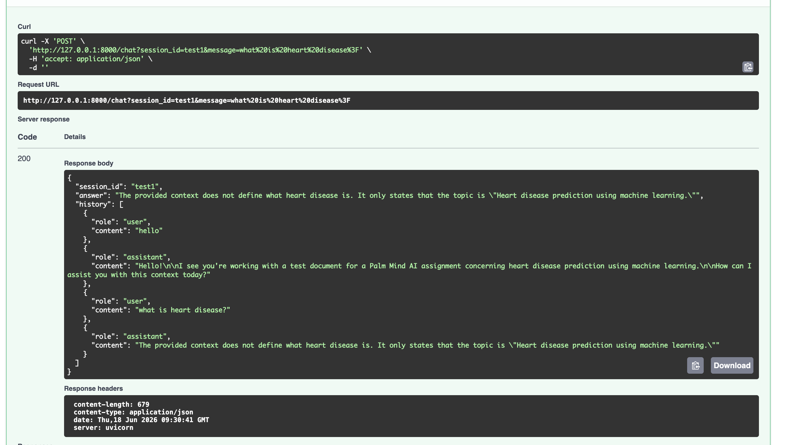
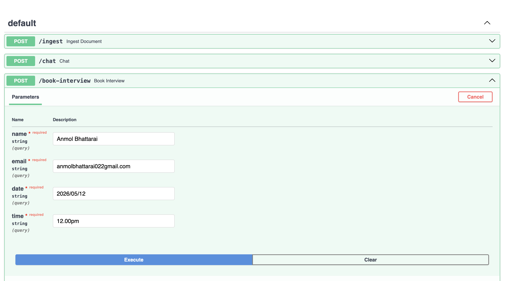
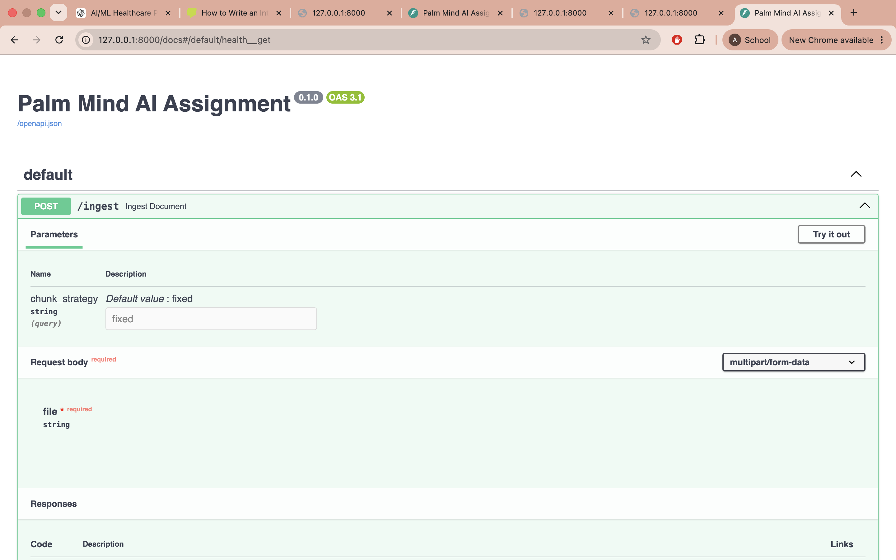

# MedQuery AI


Medical knowledge assistant powered by Retrieval-Augmented Generation (RAG).

---

## Overview

MedQuery AI is a medical RAG chatbot built using:

- FastAPI
- Qdrant Vector Database
- Sentence Transformers
- Google Gemini
- SQLite

The system retrieves relevant medical information from uploaded documents and generates context-aware responses using Gemini.

---
## Workflow

1. User uploads a medical document.
2. Document is chunked into smaller text segments.
3. Sentence Transformer generates embeddings.
4. Embeddings are stored in Qdrant Vector Database.
5. User submits a medical question.
6. Relevant chunks are retrieved through semantic search.
7. Retrieved context is passed to Gemini.
8. Gemini generates a context-aware answer.

## Features

✅ Document Upload

✅ Text Chunking

✅ Embedding Generation

✅ Qdrant Vector Storage

✅ Semantic Search

✅ Retrieval-Augmented Generation (RAG)

✅ Gemini Integration

✅ Chat Memory

✅ Swagger Documentation

✅ Health Endpoint

---

## Architecture



## Technology Stack

| Component | Technology |
|------------|------------|
| Backend | FastAPI |
| Vector Database | Qdrant |
| Embeddings | Sentence Transformers |
| LLM | Gemini |
| Database | SQLite |
| Language | Python |

---

## API Endpoints

### Health Check

```http
GET /
```

### Upload Document

```http
POST /ingest
```

### Chat

```http
POST /chat
```

---

## Screenshots

### API Overview


### Health Endpoint


### Document Upload


### Successful Ingestion


### Chat Query


### Chat Response


### Interview Booking


### Booking Success


## Installation

```bash
git clone https://github.com/Anmolbhattarai-AI/medical-rag-chatbot.git

cd medical-rag-chatbot

pip install -r requirements.txt

uvicorn app.main:app --reload
```

---
## Skills Demonstrated

- Retrieval-Augmented Generation (RAG)
- Large Language Model Integration
- Semantic Search
- Vector Databases
- FastAPI Backend Development
- REST API Design
- Prompt Engineering
- Conversational AI
- Information Retrieval
- Python Software Development
- ## Example Usage

### Upload Document

Upload a medical text document:

POST /ingest

### Ask Questions

POST /chat

Question:

What is heart disease?

Response:

Heart disease refers to a group of conditions affecting the heart and blood vessels.

## Future Improvements

- PDF Support
- Multiple Document Upload
- Hybrid Search
- Citation Support
- Frontend Interface
- Docker Deployment

---
## Project Highlights

- Developed an end-to-end Retrieval-Augmented Generation (RAG) chatbot for medical document question answering.
- Implemented semantic search using Sentence Transformers and Qdrant.
- Integrated Google Gemini for context-aware response generation.
- Designed REST APIs using FastAPI for document ingestion and chat interactions.
- Implemented conversational memory using SQLite.
- Created an extensible architecture supporting future PDF and multi-document ingestion.

## Author

Anmol Bhattarai

Computer Science and Engineering

BMS College of Engineering, Bangalore
